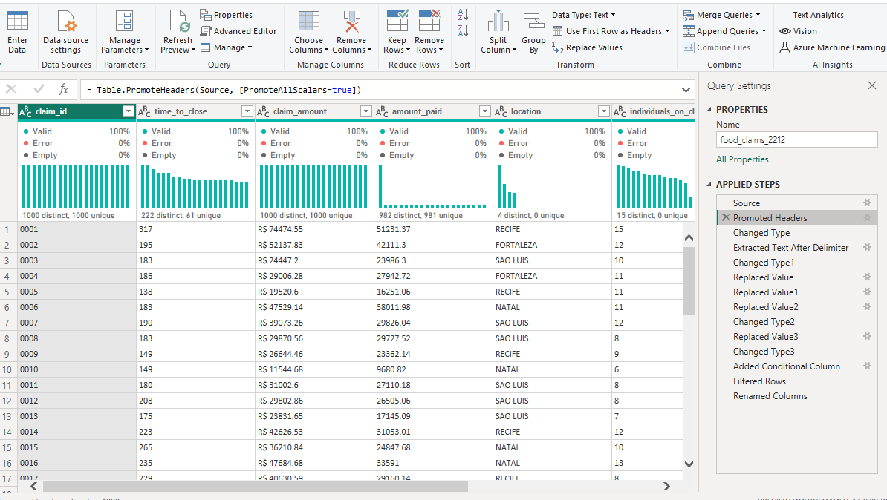

# VIVENDO-FAST-FOOD-CLAIMS-ANALYSIS

 
---

## INTRODUCTION

As part of my Datacamp Associate Analyst Certification, I undertook a power BI project on a Brazillian Fast Food company called VIVENDO. 
**Vivendo** is a fast food chain in Brazil with over 200 outlets. Customers often claim compensation from the company for food poisoning. The legal team processes these claims. The legal team has offices in four locations.

## BUSINESS PROBLEM STATEMENT
The head of the legal department wants a report on how each location differs in the time it takes to close claims.

## BUSINESS GOAL
The legal team wants to improve how long it takes to reply to customers and close claims.

## TOOL USED FOR ANALYSIS

1. Excel. 2. Power BI 3. Power Query
 
To ensure I deliver results with the best insights and recommendations for the head of the legal department and other stakeholders, the Data analysis process will take the steps below 

### THE DATA ANALYSIS PROCESS
1. DATA EXPLORATION & VALIDATION
2. DATA CLEANING
3. DATA ANALYSIS & VISUALIZATION
4. INSIGHTS AND RECOMMENDATION

## PHASE 1: DATA EXPLORATION & VALIDATION

I explored the dataset with PowerQuery to get a complete overview of the dataset and access the quality issues needed for cleaning. This is imperative because the quality of this analysis hinges on the integrity and validity of our data.

The dataset contains 1 row for each claim. The column's descriptions are highlighted below, with what is expected to validate each column

1. Claim_id column: Nominal data. The unique identifier of the claim. Missing values are not possible due to the database structure.
2. Time_to_close column: Discrete data. The number of days to close the claim. Any positive value. Replace missing values with the overall median time to close.
3. Claim_amount column: Continuous data. The initial claim requested in the currency of Brazil rounded to 2 decimal places. Replace missing values with the overall median claim amount.
4. Amount_paid column: Continuous data. Final amount paid. In the currency of Brazil. Rounded to 2 decimal places. Replace missing values with the overall median amount paid.
5. Location column: Nominal data. Location of the claim, one of “RECIFE”, “SAO LUIS”, “FORTALEZA”, or “NATAL”. Remove missing values.
6. Individuals_on_claim column: Discrete data. Number of individuals on this claim. Minimum 1 person. Replace the missing value with 0.
7. Linked_cases column: Nominal data. Whether this claim is linked to other cases. Either TRUE or FALSE. Replace missing values with FALSE.
8. Cause Column: Nominal data. Cause of the food poisoning. One of “vegetable”, “meat” or “unknown”. Replace missing values with ‘unknown’.

## PHASE 2: DATA CLEANING

Pre-Cleaning              |         Post-Cleaning
:------------------------:|:---------------------:
     |

### DATA VALIDATION STEPS

The original dataset contains **_8 columns and 2000 rows_**. I began by looking for missing values and spelling errors in each column. Due to data type error from the claim_amount column, I changed the format by eliminating the currency signs from every record in the column. The cause column contains data spelling errors, as I discovered that in most instances, ‘vegetable’ is written in lower case, while others were written in Upper case as ‘VEGETABLES’. This also data spelling error also applied to ‘meat’ values, as most were written in lower cases and a few were written in the title case ‘Meat’. Since most of the records were in lower cases, I converted the wrong data into lowercase, which made the cause column now have 3 distinct values (‘unknown’, ‘meat’, and ‘vegetable’). The following describes the validity steps I took in cleaning each column.

1. The Claim_id has 2000 distinct and 2000 unique values. There are no missing values

2. Time_to_close: The days in the time-to-close column range from 76 to 518 days and all values are positive. There are 256 distinct values and 55 unique values. There are no missing records

3. Claim_amount: All initial claims are listed in the Claim_amount column and are made in Brazilian equivalent currency (Brazillian Real). There are 2000 distinct values and 2000 unique values. There are no missing values

4. The Amount_paid column contains a list of all final claims that have been made in Brazilian reals. There are 1964 distinct values and 1962 unique values. There are 36 missing values from the column. I replaced missing values with the overall median amount paid (20105.7).

5. Location: As expected, the location column has 4 distinct locations. There are no missing values

6. Individuals_on_claim: The number of individual claims is listed here, with a range of 1 to 15 individuals per claim. There are 15 distinct values as expected. There are no missing values.

7. Linked_cases column lists all the connected claims, categorized as TRUE or FALSE. There are 26 missing values, all of which were changed to FALSE.

8. Cause column has three distinct causes. There are no missing values.

According to the fields’ requirements, each field's values matched.

## PHASE 3: DATA ANALYSIS AND VISUALIZATION

### Question 1: What is the number of claims per location

a. The location with the highest claims is RECIFE with 7101 claims.

SAO LUIS has a record of 4161 claims, FORTALEZA accounted for 2508 claims, while NATAL with the lowest number of claims accounted for 2329 claims.

b. Are the observations balanced across categories of the variable location?

From our bar chart, it is evident that the observations are not balanced across categories of the variable location when considering the total number of claims in each location. The total number of claims for each location indicates the total amount of claims made in each location and allows us to compare the magnitude of claims between the locations.

In this case, RACIFE has the highest number of claims with 7101, followed by SAO LUIS with 4161, FORTALEZA with 2508, and NATAL with the lowest count of 2329. The large differences in the total number of claims between RACIFE and the other locations suggest that the observations are not balanced.

To further prove the imbalance of the observations, we can calculate the percentage/ratio of each location’s claims to the total observation. The percentage of total claims from RACIFE is 7101/16,009*100 = 44.3% which accounted for almost half the entire claims Vivendo fast foods legal team gets. The percentage of total claims from SAO LUIS is 4161/16,009 *100 = 25.9%. FORTALEZA accounted for 15.6%(2508/16009 * 100), while NATAL accounted for 14.5% (2329/16,009 * 100).

### Question 2: What is the distribution of Time to close for all claims.

The distribution of time to close the claims shows us the number of claims for each time range. A total of 1428 claims take between 100 to 200 days to close, which accounts for 71.4% of the total claims. Overall, 489 claims take between 200 and 300 days to close. 53 claims take between 300 and 400 days to close, 24 claims take between 70 and 100 days to close, and barely 6 claims take 400 days and above. From our 2nd visual, the distribution indicates a normal distribution, indicating that the majority of the claims take a similar number of days to close. However, we also discovered some values at the extreme right, which are seen as outliers. This could be impacting the overall performance of the claims processing system.

### Question 3: What is the Relationship between Time to Close and Location

RECIFE recorded the highest time to close claims with 885 days and the equally highest sum of cases (7101)

SAO LUIS has the second highest number of days to close their claims with 517 days and also the second highest number of claims 4161. This suggests that the location with the second-highest sum of claims also had the second-longest time to close claims on average.

FORTALEZA comes third with 311 days to close 2508 claims. NATAL has the least number of days (287 days) to close 2329 claims. They all seem to have a similar average number of closing days to total claims, but it does not look like the claims processing system is efficient enough across all locations.

From our visualization, **we observe a negative relationship between time to close and location, where locations with a higher sum of claims tended to have a higher average time to close the claims, and the distance between each location for time to close those claims is too far apart. This could indicate that there are differences in the efficiency of claims processing across locations and that locations with a higher workload may have a longer processing time**.

## PHASE 4: INSIGHTS AND RECOMMENDATIONS

### INSIGHTS

RECIFE has the highest number of claims to resolve, with the highest number of days to close these claims (It takes longer days to close claims in this location).
NATAL has the lowest number of claims to resolve and spend the least number of days re-solving these claims
There is an imbalance in the efficiency of how claims are resolved between the different locations.
There are a few claims (outliers) that take extremely longer days to resolve. This needs to be looked into.

### RECOMMENDATIONS

To ensure the efficiency of closing or resolving customer claims, and the overall performance of the claims processing system, VIVENDO FAST FOOD needs to restructure the number of personnel on each legal team in each location.
RACIFE needs more personnel so, more legal staff must be given to RACIFE. Additionally, a proportionate legal team that can make a difference in each area will be assigned to the place with the fewest claims. This should help the legal team improve how long it takes to reply to customers and close claims.
Thank you for sticking with me. 😄

Merci!

REFERENCES

https://app.datacamp.com/
